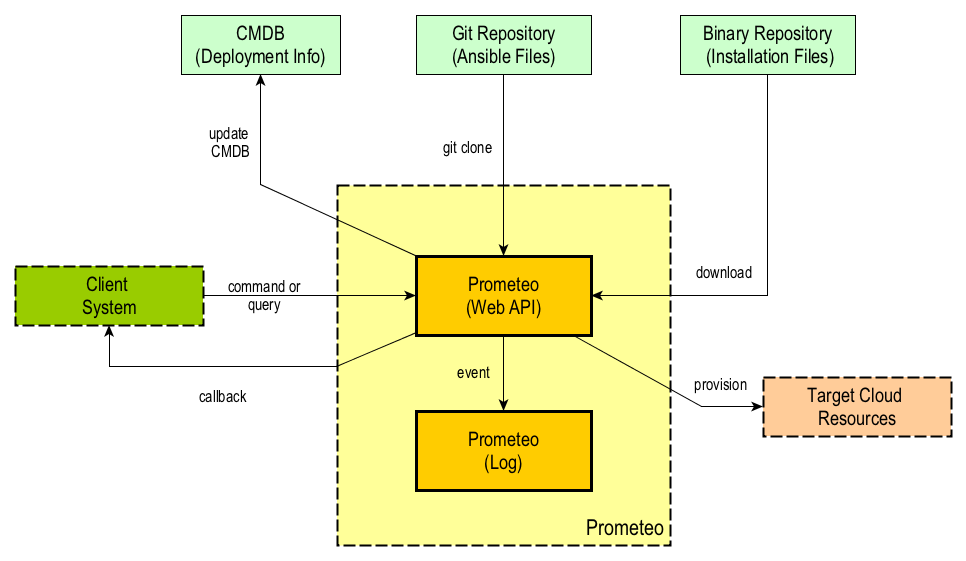

# Prometeo

Prometeo is a scalable Ansible control node, which can run in OpenShift.

It exposes a Web API based on Spring Boot accepting a YAML payload and logs the execution steps and errors into a MongoDb database.

<a name="toc"></a>
## Table of Contents
- [Overview](#overview)
- [Getting Started using build scripts](#started_scripts)
- [Getting Started using Europa](#started_europa)
- [Testing the control node](#testing_ctrl_node)
- [Executing a Configuration Repository](#exec_cfg_repo)
- [Executing a Role Repository](#exec_role_repo)
- [Executing in Developer Mode](#exec_dev_mode)
- [Command Variables](#cmd_vars)
- [Querying process status](#proc_status)
- [Web API documentation](#web_api_doc)
- [Ansible Project format](#project_format)
- [Configuration Variables](#config_vars)
- [SSH Keys](#ssh_keys)
- [Developer Mode](#dev_mode)

<a name="started_scripts"></a>
## Overview [(up)](#toc)
Prometeo is an Ansible control node designed to run as a Docker container.
The core is comprised by two processes, namely the Web API and the Log database.

The Web API receives an HTTP POST request with command and configuration information and does the following:
- Creates a new processing Thread
- Creates a global unique identifier (GUID) for the executing Thread
- Passes the GUID back to the requestor immediately and continues processing the request asynchronously
- Creates a processing folder named after the Ansible repository name and the process GUID
- Clones the Ansible repository into the processing folder
- Installs all roles required by the Ansible playbook calling the requirements.yml file
- Executes the playbook
- Removes the processing folder
- Perfoms a callback on completion of the process (if requested)
- Logs all execution steps above to the Mongo database

Additionally, a [developer mode](#dev_mode) is provided to facilitate development of playbooks on the local machine and the creation of CI using docker containers for testing deployments.

The following figure shows the main elements of the application:



<a name="started_scripts"></a>
## Getting Started using build scripts [(up)](#toc)

The easiest way to get Prometeo up and running is to use docker-compose to get the Prometeo web API and the Log containers running.

In order to build the required Docker images the [docker-build.sh](https://github.com/prometeo-cloud/prometeo/blob/master/docker-build.sh) script can be executed as follows:

```bash
$ curl https://raw.githubusercontent.com/prometeo-cloud/prometeo/master/docker-build.sh -O docker-build.sh && sh docker-build.sh
```
[Docker Compose](https://docs.docker.com/compose/) needs to be installed so that the following command can be run:

```bash
$ curl https://raw.githubusercontent.com/prometeo-cloud/prometeo/master/docker-compose.yml -O docker-compose.yml && docker-compose up
```
To test the Web API is running click on the following link: [Web API](http://localhost:8080).

<a name="started_europa"></a>
## Getting Started using Europa [(up)](#toc)

If you have windows on your PC, the easiest way to get started is to follow the steps below:
- Install VirtualBox on laptop
- Download Europa from [here](https://github.com/gatblau/europa/releases), unzip and import the “ova” file into VirtualBox (File -> Import Appliance)
- Start Europa in VirtualBox and login – details on GitHub
- Run IntelliJ and create a new project from GitHub using the Prometeo repo
- Install Postman and [Robomongo 1.0](https://download.robomongo.org/1.0.0/linux/robomongo-1.0.0-linux-x86_64-89f24ea.tar.gz) on Europa (Robo 3T 1.1 is not yet supported on CentOS 7)
- In IntelliJ settings, install the following plugins:
  - Docker Integration
  - Bash Support
  -	Robomongo
- Restart IntelliJ to use plugins
- In IntelliJ use terminal window to build and then run Prometeo
- Use Postman to test the control node
- Use IntelliJ Robomongo plugin to connect to database and inspect events

<a name="testing_ctrl_node"></a>
## Testing the control node [(up)](#toc)

To test the control node, a payload needs to be posted to the Web API to:
- **/cfg/run** to execute a configuration repository; or
- **/role/run** to execute a single role repository.

An application such as [Postman](https://www.getpostman.com/), [cURL](https://curl.haxx.se/) or the Prometeo Swagger user interface (e.g. http://prometeo-host/swagger-ui.html) can be used to post the payload.

The parameters for a raw HTTP request are:
- **URI**: http://localhost:8080/run/cfg or http://localhost:8080/run/role
- **Method**: POST
- **Content-Type header**: "application/x-yaml"
- **Body format**: RAW (with content as per the example below)

or using the curl command for example as follows:

```bash
$ curl -v -H "Content-Type: application/x-yaml" --data-binary "@src/test/resources/payload.yml" "http://localhost:8080/run/cfg"
```

The service responds immediately (as it executes asynchronously) passing back a global unique identifier that can be used to query the state of the process later.

The results can be obtained by inspecting the mongo database. [Robo 3T](https://robomongo.org/) can be used to query Mongo with a connection **localhost:27017**.

There are also synchronous endpoints as follows:
- **/run/cfg/sync**
- **/run/role/cync**

**NOTE**: More information about all available endpoints can be found by inspecting the Swagger user interface.

<a name="exec_cfg_repo"></a>
### Executing a Configuration Repository [(up)](#toc)

The payload needs to be in YAML format, and contain two main sections namely **command** and **vars**. The **command** section is restricted to the variables that Prometeo understands, whereas the **vars** section is open and any variables in YAML format can be passed as required by the ansible configuration repository or role repository respectively.

The payload to execute an Ansible [configuration repository](https://github.com/prometeo-cloud/prometeo_cfg_test) is shown in the following example:

```yaml
---
- command:
    cfgRepoUri: "https://github.com/prometeo-cloud/prometeo_cfg_test"
    tag: ""
    inventory: "local-file"
    runAs: "prometeo"
    verbosity: "vvv"
    checkMode: "no"
    callbackUri: "https://myapp/callme/"
    project: "PO123"
- vars:
    test_url: "http://repo1.maven.org/maven2/io/swagger/swagger-core/1.5.9/swagger-core-1.5.9.pom"
    test_dictionary:
        name: "Martin"
        job: "Elite Developer"
        skill: "Elite"
...
```
**Note**: Prometeo executes a *Configuration Repository* when it finds the **cfgRepoUri** variable in the payload.

 A *Configuration Repository* is a repository containing a playbook which calls one or more Ansible roles in other repositories whose location is specified in a *requirements.yml* file.

<a name="exec_role_repo"></a>
### Executing a Role Repository [(up)](#toc)

The payload to execute an Ansible [role repository](https://github.com/prometeo-cloud/prometeo_role_test) is shown in the following example:

```yaml
---
- command:
    roleRepoUri: "https://github.com/prometeo-cloud/prometeo_role_test"
    tag: ""
    inventory: "hosts"
    hostPattern: "localhost"
    runAs: "prometeo"
    verbosity: "vvv"
    checkMode: "no"
    callbackUri: "https://myapp/callme/"
    project: "PO123"
- vars:
    test_url: "http://repo1.maven.org/maven2/io/swagger/swagger-core/1.5.9/swagger-core-1.5.9.pom"
    test_dictionary:
        name: "Martin"
        job: "Elite Developer"
        skill: "Elite"
...
```

**Note**: Prometeo executes a *Role Repository* when it finds the **roleRepoUri** variable in the payload.

 A *Role Repository* is a repository containing a single Ansible role. Prometeo creates a *site.yml* on the fly to execute that single role, passing host pattern and role name information.

<a name="exec_dev_mode"></a>
### Executing in Developer Mode [(up)](#toc)

The following payload is appropriate when testing in [developer mode](#dev_mode):

```yaml
---
- command:
    folder: "prometeo_cfg_test"
    verbosity: "vvvv"
    checkMode: "no"
- vars:
    test_url: "http://repo1.maven.org/maven2/io/swagger/swagger-core/1.5.9/swagger-core-1.5.9.pom"
    test_dictionary:
        name: "Martin"
        job: "Elite Developer"
        skill: "Elite"
...
```
**Note**: *Developer Mode* allows to execute configurations or roles via the Prometeo API pointing to the local file system instead of cloning remote repositories.

<a name="cmd_vars"></a>
### Command Variables [(up)](#toc)

The **command** section of the payload contains information used by Prometeo to retrieve and execute an Ansible playbook.

The various configuration options are as follows:


| Variable  | Description  | Mandatory  |  
|---|---|---|
| **repoUri**  | The URI of the git repository containing the Ansible scripts to run.  | yes  |  
| **tag**  | The tag in the git repository to use or empty if the master is used.  | no  |   
| **verbosity**  | The level of verbosity of the Ansible execution output that is recorded in the Log database. The verbosity can be v, vv, vvv or vvvv. The default value is v. | no  |   
| **checkMode** | When 'yes' it will not make any changes on remote systems. Instead, any module instrumented to support ‘check mode’ will report what changes they would have made rather than making them. | no |
| **callbackUri**  | The URI Prometeo will call back when the process complete. No callback is performed if this value is not provided. | no  |  
| **project**  | The unique reference identifying the project associated with the request. | yes  |  
| **runAs** | The user under which Prometeo executes Ansible playbooks. This variable overrides the value defined in the environment variable **RUN_AS**. | no |  
| **inventory** | Specifies the action to take with regard to the inventory file. The options are: **none** (no inventory file is used when executing the Ansible command); **local-file** (the inventory file in the configuration project is used); **hosts** (a host pattern is passed to the Ansible command, defined by the *hostPattern* command attribute); **remote-file** (an inventory stored in a remote git repository is used - this is not implemented yet). If not value is passed, the default value is **local-file**. | no  |
| **hostPattern** | Specifies which hosts to manage when **inventory** is set to **hosts**. What hosts to apply a particular configuration or IT process to. For more information see [here](http://docs.ansible.com/ansible/latest/intro_patterns.html).| only if **inventory** is set to **hosts**. |

The **vars** element contains all the configuration variables required by the executing Ansible playbook.

The format for this section is basically a list of variables in YAML format. The variables in this section are the ones required by the scripts in the repoUri to run.

<a name="proc_status"></a>
## Querying process status [(up)](#toc)

In order to find the log entries associated with a particular process, execute the following query passing the identifier of the process (processId) retrieved when the execution was requested:

- **URI**: http://localhost:8080/logs/{processId}
- **Method**: GET
- **Accept header**: "application/x-yaml" or "application/json"

using the curl command:

```bash
$ curl -H "Accept: application/x-yaml" "http://localhost:8080/log/{processId}"
```
or to get the result in JSON format:

```bash
$ curl -H "Accept: application/json" "http://localhost:8080/log/{processId}"
```

<a name="web_api_doc"></a>
## Web API documentation [(up)](#toc)

Prometeo uses Swagger to document its web API.

To see the Swagger UI go to http://localhost:8080/swagger-ui.html.

To see the API documentation in JSON format go to http://localhost:8080/v2/api-docs.

<a name="project_format"></a>
## Ansible Project format [(up)](#toc)

Prometeo makes explicit assumptions about the format of the Ansible projects that runs.

Two types of git repositories are required:
- **Configuration Repository**: it contains a playbook, an inventory and a requirements file. The purpose of this repository is to glue together a series of roles to execute the required automation. See the [prometeo_cfg_test](https://github.com/prometeo-cloud/prometeo_cfg_test) repository for an example. This is the repository specified in the **cfgRepoUri** variable in the payload. Prometeo clones this repository and executes ansible-galaxy using the requirements.yml file to pull any roles used by the playbook.
- **Role Repository**: it contains an Ansible role. Variables are automatically passed by Prometeo to the role. See the [prometeo_role_test](https://github.com/prometeo-cloud/prometeo_role_test) for an example of a role repository. A role repository can be execute using the **roleRepoUri** variable.

<a name="config_vars"></a>
## Configuration Variables [(up)](#toc)
The prometeo docker image can be configured by changing the following environment variables:

| Variable  | Description  | Default Value  |
|---|---|---|
| HTTP_PORT  | The port number the Web API is listening for incoming HTTP connections.  | 8080  |  
| LOG_DB_HOST  | The hostname of the MongoDb database used for logging.  | log  |   
| LOG_DB_PORT  | The port number of the MongoDb database used for logging.  | 27017  |   
| LOG_DB_NAME  | The name of the log database. | prometeo |
| CORE_POOL_SIZE | Set the ThreadPoolExecutor's core pool size used to manage Ansible tasks.  | 2 |
| MAX_POOL_SIZE | Set the ThreadPoolExecutor's maximum pool size used to manage Ansible tasks. | 2 |
| QUEUE_CAPACITY | Set the capacity for the ThreadPoolExecutor's BlockingQueue. | 500 |
| HTTP_PROXY | The URI of the HTTP Proxy to use by Prometeo to access Internet resources. If not set, no proxy is used.  | Empty |
| HTTPS_PROXY | The URI of the HTTPS Proxy to use by Prometeo to access Internet resources. If not set, no proxy is used. | Empty |
| NO_PROXY | The URLs that should be excluded from proxying (on servers that should be contacted directly). | Empty |
| RUN_AS | The name of the user prometeo uses to run the Ansible process. | prometeo |

<a name="ssh_keys"></a>
## SSH Keys [(up)](#toc)

Prometeo uses a private RSA key to connect to managed hosts, therefore managed hosts need to have Prometeo's public key in order to accept connections.

To facilitate obtaining the public key over HTTP Prometeo exposes its RSA public key via the "**/pubkey**" RESTful resource.

<a name="dev_mode"></a>
## Developer Mode [(up)](#toc)

Prometeo can run in developer mode to facilitate testing playbooks in the local machine.
Developer mode runs outside of a Docker container and can be invoked by executing the Prometeo jar file from the command line passing the **WORK_DIR** environment variable pointing to the location of the folder where the playbook projects are contained.

For example:

```bash
$ java -DWORK_DIR=/Users/[user_x]/IdeaProjects -jar prometeo-0.0.1-SNAPSHOT.jar
```

to create the prometeo jar file execute the *package* goal in maven:
```bash
$ mvn package
```

Additionally, an instance of a MongoDb database is required by Prometeo to record execution logs, which can be launched as follows:

```bash
$ docker run mongo
```

In developer mode Prometeo does not perform the following operations:
- clone the Ansible Configuration Repository
- create a process specific folder for the cloned repository
- install roles from the requirements.yml file
- delete the process specific folder

**NOTE:** *WORK_DIR* must point to the **parent** folder to the one that contains the Ansible project.
